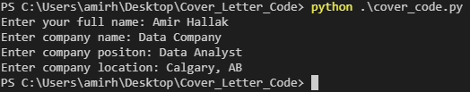

# Cover Letter Creator

This code makes it easier for the job searcher to quickly generate a PDF of his or her cover letter. It assumes that the bulk of the cover letter is already written and the main changes are often the company name, location of a company, the position they're applying for, and date. 


# Table of Contents
* [Requirments](#Requirments)
* [Imports](#Imports)
* [Configuration](#Configuration)
* [Installation/Usage](#Installation/Usage)
* [Screenshots](#Screenshots)


# Requirments
Python 3.7.5 64-bit or equivalant.

Use the package manager [pip](https://pip.pypa.io/en/stable/) to install [FPDF](https://pyfpdf.readthedocs.io/en/latest/). 
```bash
pip install FPDF
```

# Imports
```python
from fpdf import FPDF
from datetime import datetime
```

# Configuration
Write the body of your cover letter before hand and store the changes in the **cover_text.txt** file. 

Make sure when writing the body of the text in **cover_text.txt**:

1. Replace the company positon with {0}
2. Replace the company name with {1}

This is so the script can successfully replace the information the user input into their correct string slots. 


# Installation/Usage

### Step 1
* :running: Clone this repo to your local machine using: 

```bash
git clone https://github.com/amirhallak/Cover_Letter
```

### Step 2
* Make sure to follow the instructions in the [Configuration](#Configuration) section. 

### Step 3
* Run the script in your terminal:
```bash
python cover_code.py
```
### Step 4
* Input the information regarding the application and enjoy your newly exported cover letter! 

Check the [Screenshots](#Screenshots) for a visual demonstration.

# Screenshots 
* When the script is run in terminal, you will see the following output, in which you fill in your information:



* The corresponding output for the above input information:


* **_It is that simple!_**